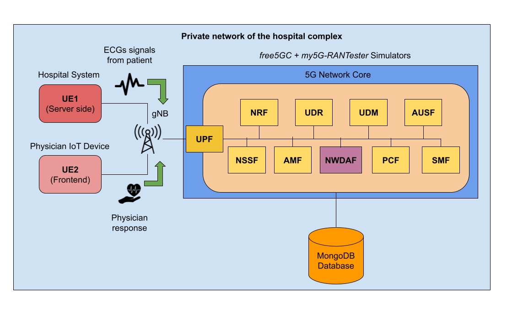
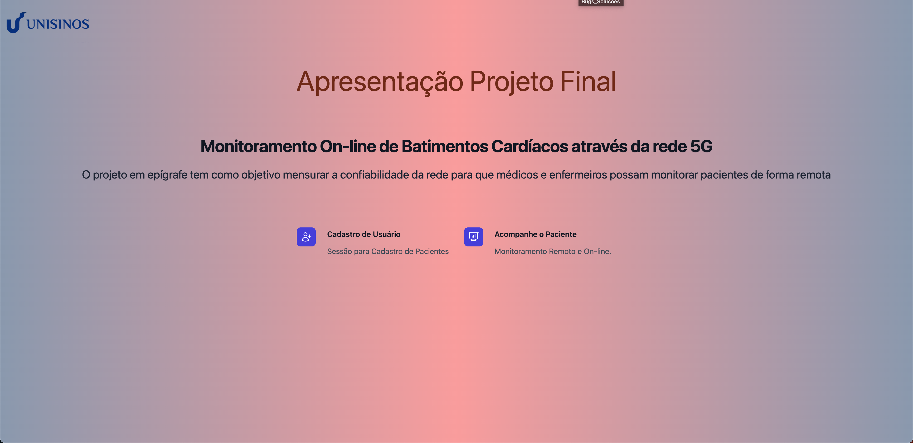
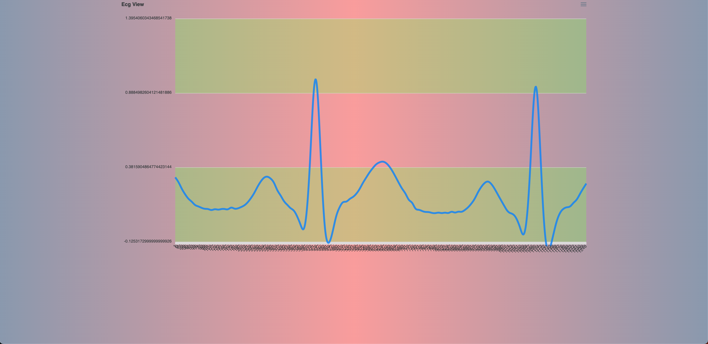

## 5G Network Architecture Simulation for Healthcare

<p align="justify">
This is the final project for the course "Desenvolvimento de Software Orientado à Computação Móvel e Ubíqua" (DT16002-00153-912009 - 2023/2) for the Graduate program in Applying Computing at Unisinos. The goal of this work is to design, implement and test a 5G Network Architecture to be used in Healthcare systems scenarios.
</p>

## 5G Healthcare architecture

<p align="justify">
The network core is implemented using the free5GC simulator to activate all network's main components (NRF, UDR, UDM, AUSF, NSSF, AMF, NWDAF, PCF, SMF and UPF). When the User Equipment (UE) devices are properly registered, they are assigned using the my5G-RANTester implementation, and all data that flows trough this newtork is stored in a MongoDB Database.
</p>


## Testing

<p align="justify">
Considering a private network infra-structure in a hospital complex, there is a scenario with two UEs registered. One is placed in the server-side as a patient monitoring device that will keep track of the patient's vital signs and send them to a gNodeB Base Station that will relay this data using the 5G Core Network infra-structure to send it to another UE registered as an Iot Device of a physician in the front-end side, that based on the vital signs' analysis will be able to take the proper action to ensure the patient well being with fast responses from any location within the hospital complex without the need of physical proximity with the patient.
</p>

## Main dependencies

### The minimum hardware requirement and software to run this experiment in simulation mode are:
Hardware:
- Computer with 8GB RAM running Linux Ubuntu 18.04 with Kernel version 5.4.0-150-generic

Software:
- Go 1.14
- MongoDB
- gcc compiler

## Build and installation

You need to install some software packages on Linux to use free5GC and my5GRAN-Tester simulators.

1 - Install Go (assuming there is no previous version installed):

```
wget https://dl.google.com/go/go1.14.4.linux-amd64.tar.gz
sudo tar -C /usr/local -zxvf go1.14.4.linux-amd64.tar.gz
mkdir -p ~/go/{bin,pkg,src}
echo 'export GOPATH=$HOME/go' >> ~/.bashrc
'export GOROOT=/usr/local/go' >> ~/.bashrc
echo 'export PATH=$PATH:$GOPATH/bin:$GOROOT/bin' >> ~/.bashrc
source ~/.bashrc
```

2 - You need to install the following libraries to compile and use UPF component in free5GC. 

```
sudo apt-get -y update
sudo apt-get -y install git gcc g++ cmake go libmnl-dev autoconf libtool libyaml-dev
cd free5gc/NFs/upf/
go get github.com/sirupsen/logrus
```

2 - Next, it is necessary to install the Linux kernel module 5G GTP-U.

```
cd gtp5g
make
sudo make install
```

3 - Now, let's build the UPF core component.

```
cd ..
mkdir build
cd build
cmake ..
make -j`nproc`
```
4 - Prior to building webconsole for free5GC, install nodejs and yarn package first:

```
sudo apt remove cmdtest
sudo apt remove yarn
curl -sS https://dl.yarnpkg.com/debian/pubkey.gpg | sudo apt-key add -
echo "deb https://dl.yarnpkg.com/debian/ stable main" | sudo tee /etc/apt/sources.list.d/yarn.list
sudo apt-get update
sudo apt-get install -y nodejs yarn
```

5 - Next, let's install the dependencies and build the binary for my5GRAN-Tester from the main project directory

```
cd my5G-RANTester
go mod download
cd ..
cd cmd 
go build app.go
```

### How to test

First, move the file (scripts/database.go > free5gc/NFs/nwdaf/util/) and the file (scripts/models.go > free5gc/NFs/nwdaf/model/). Then is necessary to run the 5G Core Network using the free5GC simulator. In order to achieve this, you must run each core component in the specific order: NRF > UDR > UDM > AUSF > NSSF > AMF > NWDAF > PCF > UPF > SMF > SERVER-WEB > SERVER-FRONT-END.

To run NFR, UDR, UDM, AUSF, NSSF, AMF, NWDAF, PCF and SMF components, run the following commands in separated terminal windows:

```
cd NFs/<name of the component>
go run <name of the component>.go
```

In order to run UPF, first it is necessary to set the iptables rules through a separated script from the main project directory:

```
cd scripts/
chmod +x config_iptables.sh
./config_iptables.sh
```

Once the iptables rules are set, the UPF module can be activated:

```
cd NFs/upf/build
sudo -E ./bin/free5gc-upfd
```

To run free5GC webconsole server, run the following command:

```
cd webconsole
go run server.go
```

To start the free5GC front-end, run:

```
cd webconsole/frontend/  
REACT_APP_HTTP_API_URL=http://127.0.0.1:5000/api PORT=3000 yarn start 
```

Once the two UEs are registered as new subscribers in the free5GC webconsole, you can initialize them with the command:

```
cd my5G-RANTester/cmd
sudo ./app load-test -n 2
```

## Issues
<p align="justify">
Our current project implementation has unresolved issues with the iptables that does not allow the communication between the UEs or external networks. Therefore, while this problem is not fixed, we leave the test suggestions here to send the simulated data from UE to another and use the stored information in the NWDAF module to generate graphics with the separated code to analyse the results in terms of delay, jitter and packet delivery ratio.
</p>

## The FrontEnd Data Application
<p align="justify">
In order to provide an interface to emulate a hospital web system, a frontEnd application in REACT was developed to enable physicians and hospital staff to register new users and monitorate patients by generating random simulated ECGs vital signs that would be sent through the network in the form of an array of numeric values to be stored in the MongoDB and analyzed by the NWDAF module to provide valuable information to the UE positioned in the server-side of this scenario.
</p>




## Main results
<p align="justify">
In order to analyse the performance of the proposed solution for this 5G network scenario application, we have considered crucial to observe the delay, jitter and packet delivery ratio values obtained when performing communication between the two UEs. The graphics can be generated by running the following command:

```
cd codes
go run plot_graphs.go
```

Often referred to as latency, delay is the time taken for a data packet to travel from the source to the destination.Low latency is essential for real-time applications such as voice and video calls, online gaming, and augmented reality/virtual reality (AR/VR). High latency can result in noticeable delays and degrade the user experience.Certain applications, such as autonomous vehicles and industrial automation, require low latency to ensure timely and responsive communication.

Jitter is the variation in delay between received packets. In other words, it measures the inconsistency or variability in packet arrival times.Applications like streaming video and voice over IP (VoIP) require a consistent and smooth flow of data. Jitter can lead to disruptions in the quality of these services.Maintaining low jitter is essential for meeting QoS requirements, especially in real-time communication scenarios.

Packet delivery ratio is the ratio of successfully delivered packets to the total number of sent packets.A high packet delivery ratio indicates a reliable network, ensuring that data is successfully transmitted without loss. Monitoring packet delivery ratio helps identify potential network issues and assess the overall quality of the communication channel.

In a 5G network, where diverse applications with varying requirements coexist, optimizing these metrics becomes crucial for providing a seamless and efficient user experience. 

Unfortunately, as mentioned before, the tests were unable to be performed due to the problems with the connection between the two UE's. This project next steps include more testing and trials to finish this work and presents significant results and detailed analysis by January/2024.
</p>